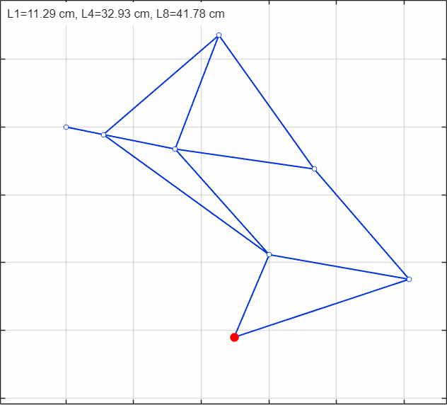

# IE410 — Introduction to Robotics
## Group 18

**Institution:** DAU (Dhirubhai Ambani University), Gandhinagar  
**Course:** IE410 — Introduction to Robotics  
**Semester:** IV, Winter 2026

---

## Table of Contents

- [Project Overview](#project-overview)
- [Part A — Object Manipulation using Arduino Braccio](#part-a--object-manipulation-using-arduino-braccio)
  - [Task 1: Pre-Programmed Pick and Place](#task-1-pre-programmed-pick-and-place)
  - [Task 2: Camera-Assisted Pick and Place](#task-2-camera-assisted-pick-and-place)
  - [Task 3: Object Handover Between Two Robot Arms](#task-3-object-handover-between-two-robot-arms)
- [Part B — Theo Jansen Walking Mechanism Simulation](#part-b--theo-jansen-walking-mechanism-simulation)
- [Repository Structure](#repository-structure)
- [External Links](#external-links)
- [References](#references)

---

## Project Overview

This repository contains the complete work for the IE410 course project — split into two parts:

- **Part A** — Hands-on manipulation tasks using the Arduino Braccio robotic arm, covering pre-programmed motion, perception-driven grasping, and two-robot coordination.
- **Part B** — MATLAB simulation of a modified Theo Jansen walking mechanism, demonstrating how a single rotary actuator can generate a human-like gait trajectory through linkage kinematics.

---

## Part A — Object Manipulation using Arduino Braccio

**Hardware:** Arduino Braccio robotic arm (6-DOF) with two-finger gripper   

The Part A project explores kinematic control of a robotic manipulator across three increasingly complex manipulation tasks — from pre-planned motion to multi-robot coordination.

---

### Task 1: Pre-Programmed Pick and Place

**File:** `Part-A/Task1/task1_pick_and_place.ino`

**Objective:** Move an object (eraser/sharpener) from Point A to Point B using a fully pre-planned motion sequence, without any sensor feedback.

**Approach:**
- Joint angles for each waypoint were designed offline and hardcoded.
- The sequence opens the gripper, lowers to Point A, closes the gripper, lifts, rotates the base 90°, and releases at Point B.
- A helper function `executeStep()` wraps `Braccio.ServoMovement()` with a 1-second delay for clean step-by-step execution.

**Motion Sequence:**

| Step | Base | Shoulder | Elbow | Wrist V | Wrist R | Gripper | Action |
|------|------|----------|-------|---------|---------|---------|--------|
| 1 | 0° | 45° | 180° | 180° | 90° | Open (10°) | Approach Point A |
| 2 | 0° | 45° | 180° | 180° | 90° | Close (73°) | Grasp object |
| 3 | 0° | 45° | 180° | 90° | 90° | Close (73°) | Lift object |
| 4 | 90° | 45° | 180° | 90° | 90° | Close (73°) | Rotate to Point B |
| 5 | 90° | 45° | 180° | 180° | 90° | Close (73°) | Lower to Point B |
| 6 | 90° | 45° | 180° | 180° | 90° | Open (10°) | Release object |

---

### Task 2: Camera-Assisted Pick and Place

**File:** `Part-A/Task2/task2_camera_assisted.ino`

**Objective:** Use visual sensing to detect an object placed at an unknown location and guide the robot arm to grasp and place it at a predefined Point B.

**Approach:**
- A smartphone/webcam detects the object and computes pixel-space error (err_x, err_y) relative to the robot's workspace center.
- Error values are sent via Serial to the Arduino in the format `<err_x,err_y>`.
- The Arduino applies a proportional controller to nudge the base and shoulder/elbow incrementally until a `<GRASP>` command is received.
- An IR sensor on pin A0 confirms object presence before closing the gripper — preventing false grasps.

**Key Parameters:**

| Parameter | Value | Description |
|-----------|-------|-------------|
| `Kp_Base` | 0.03 | Proportional gain for base rotation |
| `Kp_Reach` | 0.02 | Proportional gain for reach (shoulder/elbow) |
| `IR_SENSOR_PIN` | A0 | IR beam-break sensor for grasp confirmation |
| `drop_base` | 180° | Predefined Point B base angle |
| Hover position | Base 90°, Shoulder 120°, Elbow 90° | Default standby pose |

**Grasp Execution Phases:**
1. **Strike** — Lower arm toward object
2. **Catch** — Check IR sensor; close gripper (73°) only if beam is broken
3. **Lift** — Raise arm to safe transit height
4. **Transit** — Rotate to predefined Point B
5. **Release** — Open gripper (10°)
6. **Return** — Reset to hover position for next task

---

### Task 3: Object Handover Between Two Robot Arms

**Files:**  
`Part-A/Task3/task3_sender.ino` — Robot 1 (holds and delivers the object)  
`Part-A/Task3/task3_receiver.ino` — Robot 2 (receives and grasps the object)

**Objective:** Coordinate two Braccio arms to transfer a soft object (crumpled paper ball) from Robot 1's gripper to Robot 2's gripper without dropping it.

**Coordination Strategy:**
- Robot 1 moves the object to a predefined handover location in the shared workspace and holds it open for 7 seconds.
- Robot 2 waits 8 seconds (timed delay) to ensure Robot 1 has fully settled at the handover point, then approaches, aligns, and grasps.
- Robot 1 releases only after Robot 2 has completed its grasp — ensuring a stable, drop-free transfer.

**Robot 1 (Sender) Sequence:**

| Step | Base | Shoulder | Elbow | Wrist V | Wrist R | Gripper | Action |
|------|------|----------|-------|---------|---------|---------|--------|
| 1 | 0° | 45° | 180° | 150° | 180° | Open (0°) | Initial position |
| 2 | 0° | 45° | 180° | 150° | 180° | Close (90°) | Hold object |
| 3 | 0° | 45° | 180° | 90° | 100° | Close (90°) | Orient wrist |
| 4 | 90° | 45° | 180° | 90° | 70° | Close (90°) | Move to handover point |
| 5 | 90° | 45° | 180° | 90° | 70° | Open (10°) | Release after Robot 2 grasps |

**Robot 2 (Receiver) Sequence:**

| Step | Delay | Action |
|------|-------|--------|
| Wait | 8 s | Allow Robot 1 to reach handover point |
| Align | — | Move to gripper-open alignment (Base 100°, Shoulder 45°, Elbow 130°) |
| Grip | — | Close gripper (65°) around the object |
| Lift | — | Raise arm with object secured |
| Release | — | Open gripper (15°) to confirm transfer complete |

---

## Part B — Theo Jansen Walking Mechanism Simulation

**File:** `Part-B/modified_jansen_gait_trainer_separate_window.m`  
**Language:** MATLAB  

### Overview

This simulation reproduces a 12-link, single degree-of-freedom modified Jansen gait trainer based on the topology from Shin, Deshpande & Sulzer (JMR 2018). A single rotary crank input drives the entire linkage assembly, and the foot endpoint (ptE) traces a smooth, closed, human ankle-like trajectory over one full revolution.

### Mechanism Details

| Parameter | Value |
|-----------|-------|
| Topology | 12-link, 8-bar closed-loop |
| Degrees of Freedom | 1 (crank input θ₁) |
| Crank speed (ω) | π rad/s (2 s per cycle) |
| Angular resolution | 361 steps per cycle |
| Frame rotation | −11.4° (gait/world frame alignment) |
| Solver | MATLAB `fsolve` + damped Newton fallback |

### Link Lengths (cm)

| L1 | L2 | L3 | L4 | L5 | L6 | L7 | L8 | L9 | L10 | L11 | L12 |
|----|----|----|----|----|----|----|----|----|-----|-----|-----|
| 11.29 | 45.0 | 36.0 | 32.93 | 48.5 | 41.5 | 60.5 | 41.78 | 42.0 | 43.0 | 26.5 | 54.5 |

L1 (crank), L4 (ground link), and L8 (coupler) are the three adjustable links for tuning gait shape.

### Simulation Results

| Metric | Value |
|--------|-------|
| Horizontal span (stride length) | ~50.08 cm |
| Vertical span (step height) | ~12.74 cm |
| Loop closure residual | < 10⁻⁶ cm |
| Best RMSE vs. reference | 17.40 cm |

### Output Figures

| Figure | Description |
|--------|-------------|
| Figure 1 | One-frame mechanism assembly snapshot — 12 links (blue), joints (hollow circles), foot point ptE (red dot) |
| Figure 2 | Paper-style Fig. 4 — mechanism + simulated foot trajectory overlaid with reference gait envelope |
| Figure 3 | Gait cycle curves — horizontal and vertical ptE motion vs. gait cycle % |
| Figure 4 | 3×3 validation grid — nine reference envelopes vs. simulated trajectories; RMSE range 17.40–21.42 cm |

### Animation



### How to Run

1. Open MATLAB (R2024b or later recommended).
2. Run `modified_jansen_gait_trainer_separate_window.m`.
3. All four figures and the live animation window are generated automatically.

**Optional flags (edit inside the `cfg` struct at the top of the file):**

| Flag | Default | Effect |
|------|---------|--------|
| `cfg.showPaperFigure4` | `true` | Mechanism + trajectory overlay |
| `cfg.showNinePatternValidation` | `true` | 3×3 validation grid |
| `cfg.runAnimation` | `true` | Live mechanism animation |
| `cfg.showDiagnosticPlots` | `false` | Velocity, position, and residual plots |
| `cfg.runSensitivity` | `false` | L1/L4/L8 sensitivity sweep |
| `cfg.runLeastSquaresDemo` | `false` | Least-squares span-to-link mapping demo |

---

## Repository Structure

```
IE410-Group18-Aurum-Robotics/
│
├── Part-A/
│   ├── Task1/
│   │   └── task1_pick_and_place.ino
│   ├── Task2/
│   │   └── task2_camera_assisted.ino
│   └── Task3/
│       ├── task3_sender.ino
│       └── task3_receiver.ino
│
├── Part-B/
│   ├── modified_jansen_gait_trainer_separate_window.m
│   └── figures/
│       ├── jansen_mechanism_animation.gif
│       ├── mechanism_assembly.png
│       ├── paper_style_fig4.png
│       ├── gait_cycle_curves.png
│       └── validation_grid_3x3.png
│
└── README.md
```

---

## External Links

| Resource | Link |
|----------|------|
| Part A — Demo Video (Google Drive) | https://drive.google.com/drive/folders/1fuxnK6L13juL0kl1DMiUL3OvnvQntQ4-?usp=share_link |
| Part B — Demo Video (Google Drive) | jansen_mechanism_animation.gif](https://drive.google.com/file/d/19ueDgOKuSGHDaRASxU4plLGacA-xxt9Q/view?usp=share_link |
| Part A - Project Report (PDF) | https://drive.google.com/file/d/13tKwJdDJAJVrWvTMVWsrvgk-pLwM9Wnn/view?usp=share_link |
| Part B - Project Report (PDF) | https://drive.google.com/file/d/1X4Ew1PaBzY8H695cCmT9r90RXA8wXp9C/view?usp=share_link |

---

## References

Shin, D., Deshpande, A. D., & Sulzer, J. (2018). Single-degree-of-freedom design of a Jansen-type gait trainer for human ankle rehabilitation. *Journal of Mechanisms and Robotics*, 10(4). https://doi.org/10.1115/1.4039818

The MathWorks, Inc. (2024). *MATLAB (R2024b)*. Natick, Massachusetts. https://www.mathworks.com

Arduino. (2024). *Braccio Library*. https://www.arduino.cc/reference/en/libraries/braccio/

IE410: Introduction to Robotics — Project Part A & Part B. Course documents, DAU, Winter 2026.
